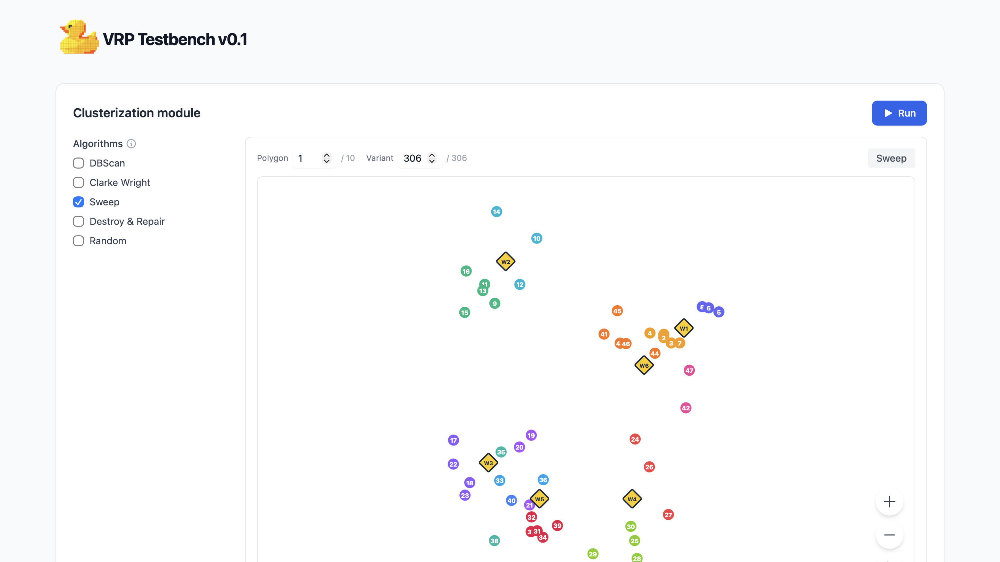
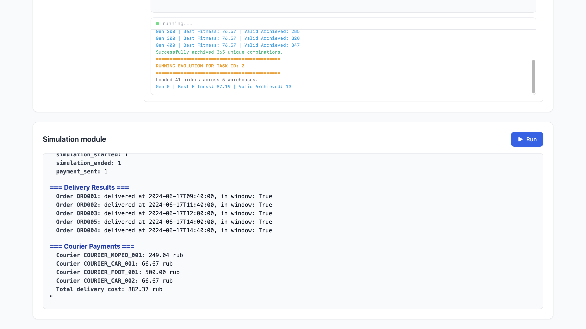

# VRP and Simulation of Retail Delivery Logistics


<div align="center">
  
</div>

## About the Project
Managing retail delivery logistics involves complex mathematical routing and precise cost calculations. Current systems often struggle with inefficient route validation, leading to financial losses in courier payouts.

Built for the Industrial track, this project addresses this gap by providing an automated VRP (Vehicle Routing Problem) simulator. Our solution evaluates delivery efficiency against a baseline using advanced algorithms to provide actionable financial and logistical analytics.

The system is divided into two core components:
1. **Clustering Module:** Automates the optimal grouping of delivery orders using DBSCAN, Clarke-Wright, Sweep, Destroy & Repair, and Graph Neural Networks (GNN).
2. **Simulation Module:** Validates VRP solutions and precisely calculates courier compensation based on simulated outcomes with strict SLA monitoring.

### Key Features
- **Multiple Clustering Algorithms:** DBSCAN, Clarke-Wright, Sweep, Destroy & Repair, Random, and GNN-based optimization
- **Advanced Cost Calculation:** Return leg tracking, dynamic cargo cost (kg × min model), and fleet capacity limits
- **Strict SLA Monitoring:** Delivery deadline validation with comprehensive error handling
- **Real-time Dashboard:** Interactive React-based frontend for visualization and analysis
- **Containerized Deployment:** Full Docker Compose setup for easy deployment
- **Comprehensive Testing:** Unit and integration tests for both backend and frontend

## Dashboard Preview

<!-- Dashboard Screenshot Placeholder -->
<div align="center">
  
</div>

<!-- Simulation Metrics Placeholder -->
<div align="center">
  
</div>

## Quick Start with Docker

The fastest way to run the entire system is using Docker Compose:

```bash
# Clone the repository
git clone https://github.com/Yellow-Duck-Studio/VRP_and_Simulation_of_Retail_Delivery_Logistics.git
cd VRP_and_Simulation_of_Retail_Delivery_Logistics

# Build and start all services
docker compose up --build

# Access the frontend at http://localhost
# Backend API will be available at http://localhost:3001
```

To stop the services:

```bash
docker compose down
```

## Development Roadmap

**MVP 0: Core Architecture & Data Ingestion (Current Scope)**
* Parsing and ingestion of raw simulation datasets.
* Initial cluster generation using DBSCAN.
* Implementation of an Evolutionary algorithm for optimal cluster configuration.
* Structured output generation of final clustering results.
* Foundational system flow with basic validation placeholders and data-reading tests.

**MVP 1: Functional Validation**
* Full implementation of VRP constraint validation logic.
* Comprehensive unit and integration testing pipelines for validation verdicts.

**MVP 2: Analytics & Refinement**
* Refinement of core simulation mechanics.
* Introduction of logistics analytics, specifically courier payment calculations.
* Integration testing for analytical outputs.

**Out of Scope (Postponed)**
* Clarke-Wright algorithm for baseline initial splitting.
* Destroy & Repair algorithms for advanced local optimization.
* Integration with external customer services.

## Technical Stack

### Backend
- **Python 3.12:** Core backend language for rapid prototyping and robust logic
- **NumPy:** C++ backed processing for high-speed mathematical array operations crucial to VRP calculations
- **scikit-learn:** Reliable pre-built algorithms (DBSCAN) and mathematical metrics
- **Pandas:** Efficient manipulation and parsing of initial raw datasets
- **Pydantic:** Strict object creation and data validation within the simulation module
- **pytest:** Primary framework for all unit and integration testing
- **FastAPI:** Modern web framework for building APIs with automatic validation
- **WebSockets:** Real-time communication for clustering progress updates

### Frontend
- **React 19:** Modern UI library for building interactive dashboards
- **TypeScript:** Type-safe JavaScript for improved developer experience
- **Vite:** Fast build tool and development server
- **TailwindCSS:** Utility-first CSS framework for rapid styling
- **Heroicons:** Beautiful SVG icon library
- **Vitest:** Fast unit testing framework for React components
- **Testing Library:** React testing utilities for component testing

### DevOps
- **Docker:** Containerization for consistent deployment
- **Docker Compose:** Multi-container orchestration
- **GitHub Actions:** CI/CD pipeline for automated testing

## Manual Installation

### Prerequisites

- Python 3.12+
- Node.js 25+
- npm

### Step 1: Install Python Dependencies

```bash
pip install -r requirements.txt
```

### Step 2: Install Frontend Dependencies

```bash
cd frontend
npm install
cd ..
```

## Running Modules Separately

### 1. Clustering Module

Run the evolutionary clustering algorithm to optimize order groupings:

```bash
python main.py DBSCAN

# Available algorithms:
python main.py CLWR
python main.py SWEEP
python main.py DSTR
python main.py RND
```

Run the Graph Neural Network (GNN) for every algorithm

```bash
python GNN/predict.py
```

This will:
- Load orders from `data/small/orders.csv`
- Load warehouses from `data/small/warehouses.csv`
- Load transport constraints from `data/transport_types.csv`
- Generate optimized clusters for each task
- Save results to `data/master_clusterizations.json`

### 2. Simulation Module

Run the discrete event simulation with clustered data:

```bash
# Basic simulation with default parameters
python -m simulator.main --input test_data_innopolis.json

# Full simulation with custom parameters
python -m simulator.main \
  --input test_data_innopolis.json \
  --start-time "2024-06-17T09:00:00" \
  --time-step 5 \
  --max-steps 100 \
  --output results.json
```

**Command-line Arguments:**
- `--input`: Path to input JSON file with simulation data
- `--start-time`: Simulation start time in ISO format (default: `2024-06-17T09:00:00`)
- `--time-step`: Time step in minutes (default: `5`)
- `--max-steps`: Maximum number of simulation steps (default: `100`)
- `--output`: Path to output JSON file for results (optional)

### 3. Frontend Dashboard

Start the development server:

```bash
python server.py
cd frontend
npm run dev
```

Access the dashboard at `http://localhost:5173`

For production build:

```bash
cd frontend
npm run build
npm run preview
```

## Input Data Format

### Clustering Module Input

- **orders.csv**: Order data with coordinates, weights, and time windows
- **warehouses.csv**: Warehouse locations and capacities
- **transport_types.csv**: Vehicle types with speed and payload limits

### Simulation Module Input

The simulation expects a JSON file with the following structure:

```json
{
  "warehouses": [...],
  "courier_types": [...],
  "couriers": [...],
  "orders": [...],
  "routes": [...],
  "distance_matrix": {...}
}
```

See `simulator/input_schema.json` for the complete schema definition and `simulator/test_data_innopolis.json` for an example.

## API Documentation

### Clustering Endpoints

#### POST /api/cluster
Run clustering algorithms on selected dataset.

**Request Body:**
```json
{
  "algorithms": ["DBSCAN", "Clarke Wright"],
  "dataset": "large",
  "gnn_algorithm": "clarke_wright"
}
```

**Response:**
```json
{
  "DBSCAN": {
    "task_1": [...],
    "task_2": [...]
  },
  "Clarke Wright": {
    "task_1": [...],
    "task_2": [...]
  }
}
```

#### WebSocket /ws/cluster
Real-time clustering progress updates.

**Message Types:**
- `algo_start`: Algorithm execution started
- `log`: Progress log line
- `algo_done`: Algorithm completed with results
- `error`: Error occurred
- `done`: All algorithms completed

### Simulation Endpoints

#### POST /api/simulate
Run discrete event simulation.

**Request Body:**
```json
{
  "input": "test_data_innopolis.json",
  "time_step": 5,
  "max_steps": 100,
  "strict": true
}
```

**Response:** Simulation results JSON

#### GET /api/simulate/inputs
List available simulation input files.

**Response:**
```json
{
  "inputs": ["test_data_innopolis.json", "another_input.json"]
}
```

### GNN Endpoints

#### GET /api/gnn/{algorithm}
Load pre-computed GNN algorithm results.

**Available algorithms:** `greedy`, `clarke_wright`, `sweep`, `dbscan_eps_0.1`, `dbscan_eps_0.2`, etc.

## Deployment

### Production Deployment
The application is deployed at: **http://10.93.27.5:80**

### Docker Deployment
```bash
# Build and start all services
docker compose up --build

# Stop services
docker compose down
```

### Environment Variables
- `VITE_API_BASE_URL`: Backend API base URL (for frontend)
- `PYTHONPATH`: Python module path

## Testing

### Backend Tests
```bash
# Run all tests
pytest

# Run with coverage
pytest --cov=simulator

# Run specific test file
pytest simulator/tests/unit/validator/test_report_summary.py
```

### Frontend Tests
```bash
cd frontend
npm test

# Run with coverage
npm run coverage
```

## Documentation

- [Pipeline Overview](PIPELINE_OVERVIEW.md) - Clustering pipeline architecture
- [Experiments Overview](EXPERIMENTS_OVERVIEW.md) - Experiment framework guide
- [CI/CD Pipeline](CICD_PIPELINE.md) - Continuous integration setup

## Team

**Yellow-Duck-Studio**
- Ekaterina Ivanova
- Egor Novokreshchenov
- Daria Galushko
- Azamat Kharisov
- Aleksandr Kurilenko
- Ivan Prikhodko
- Matvei Kantserov
- Konstantin Smirnov

## Acknowledgments

- Built for the Industrial track of the Innopolis University project
- Customers: Egor Torshin, Victor Lobachev
